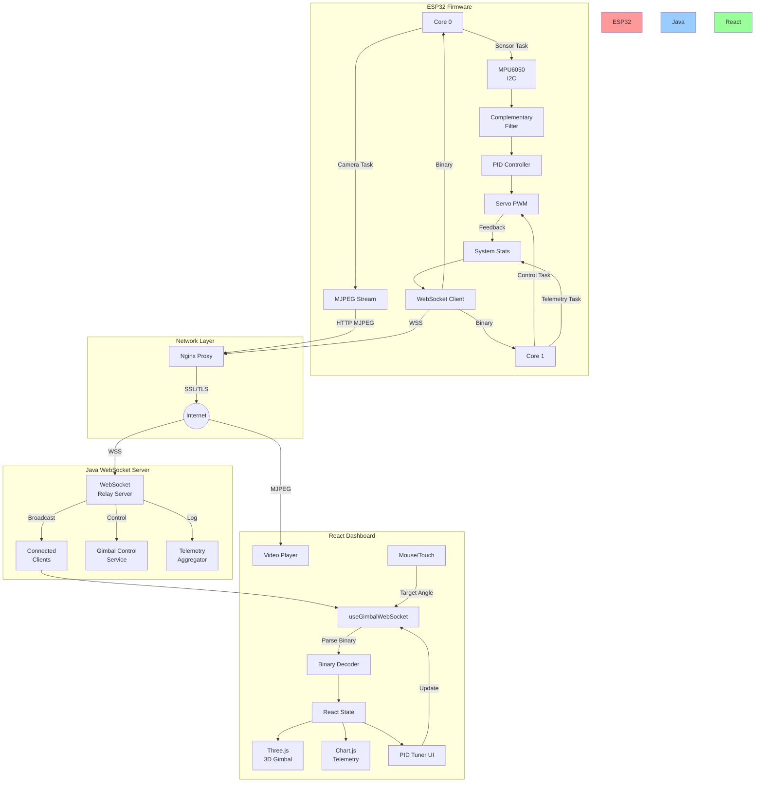
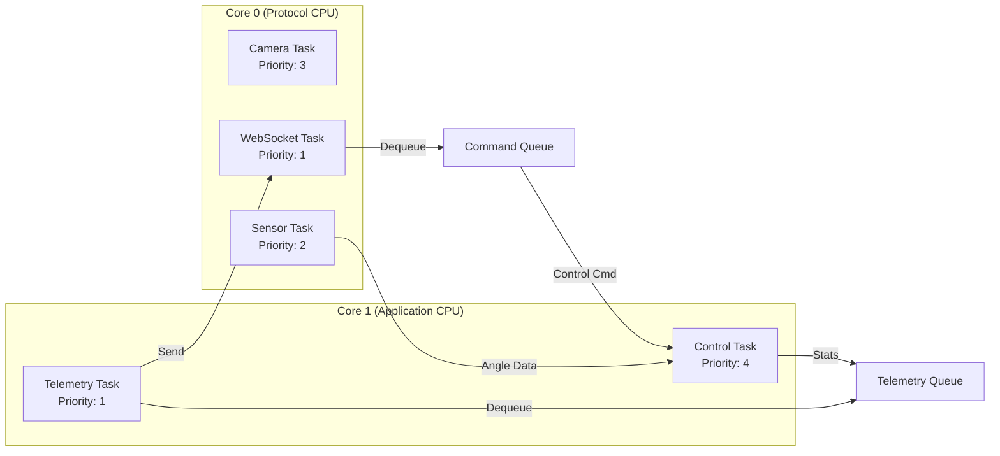
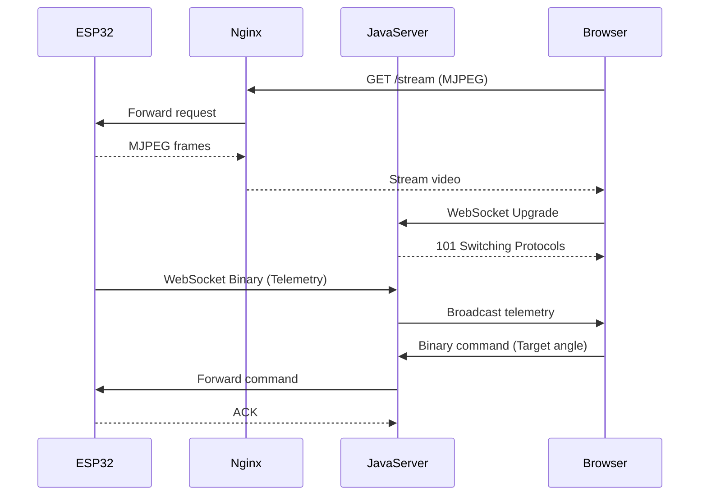
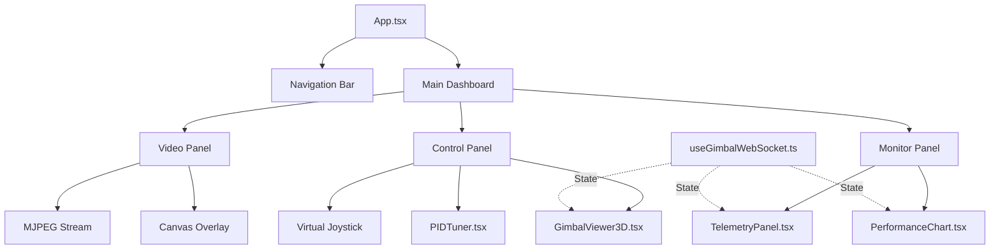

# ESP32 짐벌 제어 시스템 - 아키텍처 설계

> **시스템 아키텍처 및 컴포넌트 상세 설계**
>
> @author Sim Woo-Keun <smileteeth14@gmail.com>  
> @date 2026-02-25 initial draft  
> @copyright (C) 2026 SimSimEEE - All Rights Reserved.

---

## 🏛️ 전체 시스템 아키텍처



---

## 📦 컴포넌트 상세 설계

### 1️⃣ ESP32 Firmware Layer

#### 1.1 FreeRTOS 태스크 아키텍처



**태스크 할당 전략**:

| 태스크 | 코어 | 우선순위 | 스택 크기 | 주기 | 설명 |
|--------|------|----------|-----------|------|------|
| **Camera Task** | Core 0 | 3 | 4KB | 33ms (30fps) | MJPEG 프레임 캡처 및 전송 |
| **Sensor Task** | Core 0 | 2 | 2KB | 10ms (100Hz) | MPU6050 읽기 + 필터링 |
| **WebSocket Task** | Core 0 | 1 | 8KB | Event-driven | 제어 명령 수신 및 전송 |
| **Control Task** | Core 1 | 4 | 3KB | 20ms (50Hz) | PID 제어 + 서보 PWM |
| **Telemetry Task** | Core 1 | 1 | 2KB | 100ms (10Hz) | 시스템 통계 수집 |

**동기화 메커니즘**:
- **FreeRTOS Queue**: 크로스-코어 명령 전달
- **Mutex**: 공유 자원 보호 (Wi-Fi, I2C)
- **Semaphore**: 태스크 간 동기화

#### 1.2 센서 데이터 처리 파이프라인

```cpp
// 상보 필터 구현 예시
class ComplementaryFilter {
private:
    float alpha = 0.96f;  // 자이로 가중치
    float pitch = 0.0f;
    float roll = 0.0f;
    
public:
    void update(float gyro_pitch, float gyro_roll, 
                float accel_pitch, float accel_roll, float dt) {
        // 자이로 적분 + 가속도 보정
        pitch = alpha * (pitch + gyro_pitch * dt) + (1 - alpha) * accel_pitch;
        roll  = alpha * (roll  + gyro_roll  * dt) + (1 - alpha) * accel_roll;
    }
    
    float getPitch() const { return pitch; }
    float getRoll()  const { return roll;  }
};
```

**데이터 흐름**:
1. MPU6050 I2C Read (DMP 미사용, Raw 데이터)
2. 자이로/가속도 캘리브레이션 오프셋 적용
3. 상보 필터로 각도 계산
4. 이동 평균 필터 (3-sample)로 노이즈 제거
5. PID 제어기에 입력

#### 1.3 PID 제어 시스템

```cpp
class PIDController {
private:
    float Kp, Ki, Kd;
    float integral = 0.0f;
    float prev_error = 0.0f;
    float output_min = -90.0f;  // 서보 범위
    float output_max = 90.0f;
    
public:
    float compute(float setpoint, float measured, float dt) {
        float error = setpoint - measured;
        
        // P항
        float p_term = Kp * error;
        
        // I항 (Anti-windup)
        integral += error * dt;
        integral = constrain(integral, -10.0f, 10.0f);
        float i_term = Ki * integral;
        
        // D항
        float derivative = (error - prev_error) / dt;
        float d_term = Kd * derivative;
        prev_error = error;
        
        // 출력 제한
        float output = p_term + i_term + d_term;
        return constrain(output, output_min, output_max);
    }
    
    void setTunings(float kp, float ki, float kd) {
        Kp = kp; Ki = ki; Kd = kd;
        integral = 0.0f;  // Reset integrator
    }
};
```

**튜닝 전략**:
- **Ziegler-Nichols 방법**: 초기 계수 추정
- **런타임 조정**: 웹 UI에서 실시간 $K_p, K_i, K_d$ 수정
- **Anti-windup**: I항 적분 포화 방지

#### 1.4 시스템 텔레메트리

수집 메트릭:

```cpp
struct SystemTelemetry {
    // Memory
    uint32_t free_heap;           // Bytes
    uint32_t min_free_heap;       // Lifetime minimum
    uint16_t stack_hwm_camera;    // High Water Mark
    uint16_t stack_hwm_control;
    
    // CPU
    uint8_t cpu_load_core0;       // Percentage
    uint8_t cpu_load_core1;
    
    // Network
    int8_t wifi_rssi;             // dBm
    uint16_t ws_rtt;              // Round-trip time (ms)
    uint32_t packets_sent;
    uint32_t packets_lost;
    
    // Power
    float voltage;                // V (from INA219)
    float current;                // mA
    
    // Control
    float current_pitch;          // Degrees
    float current_roll;
    float target_pitch;
    float target_roll;
    uint32_t timestamp;           // millis()
} __attribute__((packed));
```

---

### 2️⃣ Network & Server Layer

#### 2.1 통신 프로토콜 구조



#### 2.2 Java WebSocket Server 아키텍처

```java
public class GimbalWebSocketServer {
    private final Map<String, Session> espSessions = new ConcurrentHashMap<>();
    private final Map<String, Session> clientSessions = new ConcurrentHashMap<>();
    private final TelemetryAggregator aggregator;
    
    @OnMessage
    public void onBinaryMessage(ByteBuffer buffer, Session session) {
        MessageType type = parseMessageType(buffer);
        
        switch (type) {
            case TELEMETRY:
                SystemTelemetry telemetry = deserializeTelemetry(buffer);
                aggregator.store(telemetry);
                broadcast(clientSessions, buffer);  // Relay to clients
                break;
                
            case CONTROL_COMMAND:
                ControlCommand cmd = deserializeCommand(buffer);
                validateAndForward(espSessions, cmd);
                break;
                
            case PID_UPDATE:
                PIDParams params = deserializePID(buffer);
                broadcast(espSessions, buffer);  // Update ESP32
                break;
        }
    }
}
```

**세션 관리**:
- ESP32 세션: 1개 (단일 디바이스, heartbeat 30s)
- Client 세션: N개 (다중 시청자, heartbeat 10s)
- 연결 끊김 시 재연결 로직 (Exponential Backoff)

---

### 3️⃣ React Dashboard Layer

#### 3.1 컴포넌트 계층 구조



#### 3.2 Three.js 3D 디지털 트윈

**짐벌 3D 모델 구조**:

```typescript
// GimbalViewer3D.tsx
const createGimbalModel = (scene: THREE.Scene) => {
    // Base (고정)
    const base = new THREE.Mesh(
        new THREE.CylinderGeometry(0.5, 0.5, 0.2, 32),
        new THREE.MeshStandardMaterial({ color: 0x333333 })
    );
    scene.add(base);
    
    // Pan axis (회전 - Yaw)
    const panAxis = new THREE.Group();
    panAxis.position.y = 0.3;
    base.add(panAxis);
    
    const panPlatform = new THREE.Mesh(
        new THREE.BoxGeometry(0.8, 0.1, 0.8),
        new THREE.MeshStandardMaterial({ color: 0x4444ff })
    );
    panAxis.add(panPlatform);
    
    // Tilt axis (회전 - Pitch)
    const tiltAxis = new THREE.Group();
    tiltAxis.position.y = 0.2;
    panAxis.add(tiltAxis);
    
    const camera = new THREE.Mesh(
        new THREE.BoxGeometry(0.3, 0.2, 0.4),
        new THREE.MeshStandardMaterial({ color: 0xff4444 })
    );
    tiltAxis.add(camera);
    
    return { panAxis, tiltAxis };
};

// 실시간 각도 동기화
const updateGimbalAngles = (pitch: number, roll: number) => {
    if (gimbalRef.current) {
        gimbalRef.current.panAxis.rotation.y = roll * (Math.PI / 180);
        gimbalRef.current.tiltAxis.rotation.x = pitch * (Math.PI / 180);
    }
};
```

**애니메이션 루프**:
```typescript
const animate = () => {
    requestAnimationFrame(animate);
    
    // 텔레메트리 데이터로 각도 업데이트
    if (latestTelemetry) {
        updateGimbalAngles(
            latestTelemetry.current_pitch,
            latestTelemetry.current_roll
        );
    }
    
    renderer.render(scene, camera);
};
```

#### 3.3 실시간 차트 시스템

**Chart.js 설정**:
```typescript
const chartConfig: ChartConfiguration = {
    type: 'line',
    data: {
        datasets: [
            {
                label: '목표 각도 (Pitch)',
                data: targetPitchHistory,
                borderColor: 'rgb(255, 99, 132)',
                backgroundColor: 'rgba(255, 99, 132, 0.1)',
            },
            {
                label: '실제 각도 (Pitch)',
                data: currentPitchHistory,
                borderColor: 'rgb(54, 162, 235)',
                backgroundColor: 'rgba(54, 162, 235, 0.1)',
            }
        ]
    },
    options: {
        animation: false,  // 성능 최적화
        scales: {
            x: {
                type: 'realtime',
                realtime: {
                    duration: 20000,  // 20초 window
                    refresh: 100,      // 100ms refresh
                }
            }
        }
    }
};
```

**데이터 업데이트 최적화**:
- 링 버퍼(Circular Buffer) 사용하여 메모리 효율성
- requestAnimationFrame 기반 렌더링
- 데이터 포인트 최대 200개 제한

---

## 🔐 보안 및 안정성

### 인증 및 권한
- **Basic Auth**: Nginx 레벨에서 기본 인증
- **SSL/TLS**: Let's Encrypt 인증서 (DuckDNS)
- **Rate Limiting**: 제어 명령 초당 10회 제한

### 에러 처리
- **ESP32**: Watchdog Timer (30s 타임아웃)
- **WebSocket**: 자동 재연결 (Exponential Backoff)
- **서버**: Graceful shutdown 및 세션 복구

### 모니터링
- **Heap 부족 경고**: Free heap < 10KB 시 알림
- **연결 끊김 감지**: Heartbeat 실패 시 재연결 시도
- **성능 저하 감지**: FPS < 15 또는 RTT > 500ms 시 경고

---

## 📊 성능 최적화 전략

### ESP32 측
1. **DMA 사용**: I2C 및 SPI 전송 시 CPU 부하 감소
2. **PSRAM 활용**: 카메라 버퍼를 외부 RAM에 할당
3. **CPU 주파수 조정**: 고성능 모드 240MHz
4. **Wi-Fi 파워 모드**: WIFI_PS_NONE (절전 비활성화)

### 네트워크 측
1. **바이너리 프로토콜**: JSON 대비 70% 크기 감소
2. **gzip 압축**: Nginx 레벨에서 텍스트 데이터 압축
3. **CDN 캐싱**: 정적 리소스 CloudFlare 캐싱

### 웹 측
1. **Web Worker**: 바이너리 파싱을 별도 스레드에서 처리
2. **Canvas Offscreen**: Three.js 렌더링 오프스크린
3. **Virtual Scrolling**: 텔레메트리 로그 가상 스크롤

---

**Last Updated**: 2026-02-25  
**Version**: 1.0.0-draft  
**Branch**: feature/gimbal-dashboard
