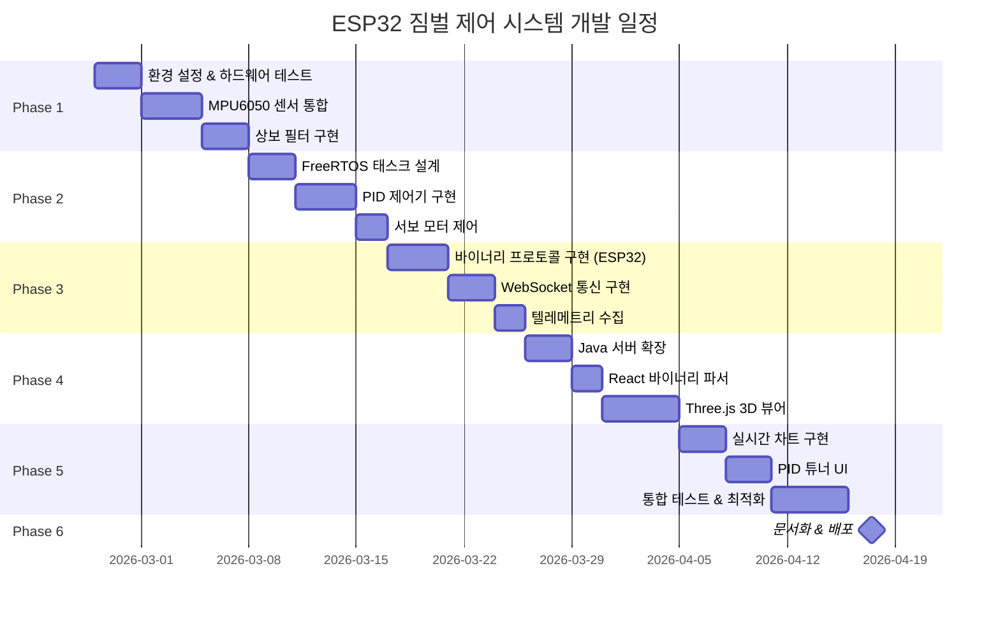

# ESP32 짐벌 제어 시스템 - 구현 로드맵

> **단계별 구현 계획 및 마일스톤**
>
> @author Sim Woo-Keun <smileteeth14@gmail.com>  
> @date 2026-02-25 initial draft  
> @copyright (C) 2026 SimSimEEE - All Rights Reserved.

---

## 🗓️ 프로젝트 타임라인



**예상 총 기간**: 약 6-8주

---

## 📋 Phase 1: 센서 통합 및 각도 추정

### 목표
ESP32에서 MPU6050 센서 데이터를 읽고 상보 필터로 정확한 짐벌 각도를 추정합니다.

### Task List

- [ ] **1.1 개발 환경 설정** (1일)
  - PlatformIO 프로젝트 생성 (`esp32-gimbal-firmware`)
  - MPU6050 라이브러리 설치 (I2Cdevlib 또는 Adafruit)
  - 하드웨어 연결 확인 (I2C 스캔 테스트)

- [ ] **1.2 MPU6050 기본 동작** (2일)
  - I2C 통신 설정 (SCL: GPIO 22, SDA: GPIO 21)
  - Raw 데이터 읽기 (자이로, 가속도)
  - 센서 캘리브레이션 (평면에서 정지 상태 오프셋 계산)
  - Serial 출력으로 데이터 확인

- [ ] **1.3 상보 필터 구현** (3일)
  - 자이로스코프 적분 (각속도 → 각도)
  - 가속도계 각도 계산 (atan2)
  - 상보 필터 융합 (alpha = 0.96)
  - 이동 평균 필터 추가 (3-sample)
  - 각도 정확도 검증 (실제 각도와 비교)

### 검증 기준
✅ MPU6050에서 안정적으로 데이터 읽기 (100Hz)  
✅ 상보 필터 출력 각도 오차 ±2° 이내  
✅ Serial 출력으로 실시간 각도 확인

### 산출물
- `src/sensors/MPU6050Sensor.cpp`
- `src/filters/ComplementaryFilter.cpp`
- `test/test_sensor.cpp`

---

## 📋 Phase 2: PID 제어 및 서보 제어

### 목표
목표 각도를 입력받아 PID 제어로 서보 모터를 정밀하게 제어합니다.

### Task List

- [ ] **2.1 FreeRTOS 태스크 구조 설계** (3일)
  - Core 0: Sensor Task (100Hz)
  - Core 1: Control Task (50Hz)
  - Queue를 통한 데이터 전달
  - Mutex로 I2C 버스 보호

- [ ] **2.2 PID 제어기 구현** (4일)
  - PID 클래스 작성 (`PIDController.cpp`)
  - Ziegler-Nichols 방법으로 초기 튜닝
  - Anti-windup 구현 (I항 적분 포화 방지)
  - 출력 제한 (-90° ~ +90°)
  - Step response 테스트

- [ ] **2.3 서보 모터 PWM 제어** (2일)
  - LEDC 라이브러리 사용 (ESP32 PWM)
  - 각도 → PWM 변환 (500us ~ 2500us)
  - 2개 서보 독립 제어 (Pitch, Roll)
  - 부드러운 움직임 확인

### 검증 기준
✅ 목표 각도에 2초 이내 도달 (settling time)  
✅ 오버슈트 < 10%  
✅ 정상 상태 오차 ±1° 이내

### 산출물
- `src/control/PIDController.cpp`
- `src/actuators/ServoController.cpp`
- `src/tasks/ControlTask.cpp`

---

## 📋 Phase 3: 바이너리 통신 구현

### 목표
바이너리 WebSocket 프로토콜로 텔레메트리 전송 및 제어 명령 수신을 구현합니다.

### Task List

- [ ] **3.1 바이너리 메시지 직렬화** (2일)
  - 프로토콜 헤더 구조체 정의
  - CRC16 계산 함수 구현
  - 텔레메트리 메시지 생성 함수
  - 제어 명령 파싱 함수

- [ ] **3.2 WebSocket 클라이언트** (3일)
  - WebSocket 라이브러리 (arduinoWebSockets)
  - 바이너리 모드 전송 설정
  - 재연결 로직 (Exponential Backoff)
  - Heartbeat 구현 (10초 주기)

- [ ] **3.3 텔레메트리 수집** (2일)
  - Free heap, stack high water mark
  - CPU load 계산 (FreeRTOS stats)
  - Wi-Fi RSSI
  - PID 출력값, 서보 PWM
  - 100ms 주기로 전송

- [ ] **3.4 제어 명령 처리** (2일)
  - ControlCommand 메시지 수신
  - 목표 각도 업데이트
  - PIDUpdate 메시지 처리
  - ACK 응답 전송

### 검증 기준
✅ 텔레메트리 10Hz로 안정적 전송  
✅ 제어 명령 RTT < 50ms  
✅ 패킷 손실률 < 0.5%  
✅ CRC16 검증 통과율 100%

### 산출물
- `src/comm/BinaryProtocol.cpp`
- `src/comm/WebSocketClient.cpp`
- `src/tasks/TelemetryTask.cpp`

---

## 📋 Phase 4: 웹 대시보드 개발

### 목표
React 대시보드에서 바이너리 데이터를 파싱하고 3D로 짐벌을 시각화합니다.

### Task List

- [ ] **4.1 Java 서버 확장** (3일)
  - `GimbalWebSocketHandler.java` 작성
  - 바이너리 메시지 라우팅
  - ESP32 세션 관리
  - 다중 클라이언트 브로드캐스트

- [ ] **4.2 React 바이너리 파서** (2일)
  - `useGimbalWebSocket.ts` 커스텀 훅
  - DataView로 바이너리 파싱
  - CRC16 검증
  - React State에 매핑

- [ ] **4.3 Three.js 3D 짐벌 뷰어** (5일)
  - 3D 짐벌 모델 생성 (Geometry)
  - 조명 및 카메라 설정
  - 실시간 각도 동기화 (Euler angles)
  - OrbitControls로 뷰 조작
  - 애니메이션 최적화 (60fps)

### 검증 기준
✅ 3D 모델이 실제 짐벌 각도와 동기화  
✅ 60fps 부드러운 애니메이션  
✅ 바이너리 파싱 에러율 0%

### 산출물
- `esp32-camera-server/src/.../GimbalWebSocketHandler.java`
- `esp32-camera-client/src/hooks/useGimbalWebSocket.ts`
- `esp32-camera-client/src/components/GimbalViewer3D.tsx`

---

## 📋 Phase 5: 모니터링 및 튜닝 UI

### 목표
시스템 텔레메트리를 실시간 차트로 표시하고 런타임에 PID를 튜닝합니다.

### Task List

- [ ] **5.1 실시간 차트 구현** (3일)
  - Chart.js 설정 (line chart with realtime plugin)
  - 목표 vs 실제 각도 차트
  - CPU/Memory 사용률 차트
  - RTT 및 패킷 손실 차트
  - 링 버퍼로 메모리 효율화

- [ ] **5.2 PID 튜너 UI** (3일)
  - Slider로 Kp, Ki, Kd 조정
  - 실시간 적용 (WebSocket PIDUpdate)
  - Step response 그래프
  - 프리셋 저장/로드 (LocalStorage)
  - EEPROM 저장 버튼

- [ ] **5.3 시스템 모니터 패널** (2일)
  - 메모리 게이지
  - Wi-Fi 신호 강도 표시
  - 에러 로그 뷰어
  - Heartbeat 상태 LED

- [ ] **5.4 통합 테스트** (3일)
  - 전체 기능 End-to-End 테스트
  - 부하 테스트 (다중 클라이언트)
  - 네트워크 불안정 환경 테스트
  - 메모리 누수 검사

- [ ] **5.5 성능 최적화** (2일)
  - ESP32: Task 우선순위 조정
  - 웹: Web Worker로 파싱 오프로드
  - Three.js: LOD (Level of Detail)
  - 네트워크: 압축 알고리즘 적용

### 검증 기준
✅ PID 튜닝 반영 시간 < 500ms  
✅ 차트 렌더링 60fps 유지  
✅ 4시간 연속 동작 안정성 확인  
✅ 메모리 사용량 < ESP32 총 Heap의 70%

### 산출물
- `esp32-camera-client/src/components/PerformanceChart.tsx`
- `esp32-camera-client/src/components/PIDTuner.tsx`
- `esp32-camera-client/src/components/TelemetryPanel.tsx`

---

## 📋 Phase 6: 문서화 및 배포

### 목표
프로젝트를 문서화하고 프로덕션 환경에 배포합니다.

### Task List

- [ ] **6.1 사용자 문서 작성** (1일)
  - `USER_GUIDE.md`: 설치 및 사용법
  - `HARDWARE_SETUP.md`: 하드웨어 연결 가이드
  - `TROUBLESHOOTING.md`: 문제 해결 가이드

- [ ] **6.2 API 문서 작성** (1일)
  - ESP32 펌웨어 API 레퍼런스
  - WebSocket 프로토콜 예제
  - Java 서버 API 문서

- [ ] **6.3 프로덕션 배포** (1일)
  - EC2 배포 스크립트 작성
  - DuckDNS + SSL 설정
  - Docker Compose 업데이트
  - GitHub Actions CI/CD

### 검증 기준
✅ 신규 사용자가 문서만으로 시스템 구축 가능  
✅ 프로덕션 환경에서 24시간 안정성 확인  
✅ README에 데모 영상 및 아키텍처 다이어그램 추가

### 산출물
- `docs/USER_GUIDE.md`
- `docs/HARDWARE_SETUP.md`
- `docs/API_REFERENCE.md`
- `.github/workflows/deploy.yml`

---

## 🎯 마일스톤 및 데모

### Milestone 1: 센서 통합 완료 (Week 1-2)
**데모**: Serial 모니터로 실시간 각도 출력

```
[SENSOR] Pitch:  45.2°, Roll: -12.3°
[SENSOR] Pitch:  45.1°, Roll: -12.4°
[SENSOR] Pitch:  45.3°, Roll: -12.2°
```

### Milestone 2: 제어 시스템 완료 (Week 3-4)
**데모**: 시리얼 입력으로 목표 각도 변경 → 서보 자동 이동

```
> set_target 30 -20
[PID] Target updated: Pitch=30°, Roll=-20°
[CONTROL] Moving... Current: 45°, Target: 30°
[CONTROL] Reached! Settling time: 1.8s
```

### Milestone 3: 통신 구현 완료 (Week 4-5)
**데모**: 웹 콘솔에서 텔레메트리 실시간 수신

```javascript
{
  freeHeap: 45280,
  cpuLoadCore0: 42,
  wifiRSSI: -56,
  currentPitch: 30.1,
  targetPitch: 30.0
}
```

### Milestone 4: 3D 시각화 완료 (Week 5-6)
**데모**: Three.js로 짐벌이 실시간 움직이는 화면 캡처


### Milestone 5: 전체 시스템 통합 (Week 7-8)
**데모**: 풀스택 데모 영상
- 마우스로 짐벌 제어
- 실시간 차트 업데이트
- PID 계수 조정
- 시스템 모니터링

---

## ⚠️ 리스크 관리

### 주요 리스크 및 대응 방안

| 리스크 | 영향도 | 발생 확률 | 대응 방안 |
|--------|--------|-----------|-----------|
| **MPU6050 노이즈** | 높음 | 중간 | Kalman Filter로 업그레이드 고려 |
| **서보 토크 부족** | 중간 | 낮음 | MG995 등 고토크 서보로 교체 |
| **Wi-Fi 지연** | 중간 | 중간 | 유선 Ethernet 옵션 추가 |
| **ESP32 메모리 부족** | 높음 | 높음 | PSRAM 활성화, 코드 최적화 |
| **Three.js 성능 저하** | 낮음 | 중간 | LOD, 텍스처 압축 |

---

## 📊 성능 목표 (KPI)

| 지표 | 목표 | 측정 방법 |
|------|------|-----------|
| **영상 지연** | < 200ms | 타임스탬프 비교 |
| **제어 RTT** | < 50ms | WebSocket ping-pong |
| **각도 정확도** | ±1° | 실측 vs 센서 |
| **FPS** | > 20 fps | MJPEG 메타데이터 |
| **CPU 사용률** | < 80% | FreeRTOS 통계 |
| **메모리 여유** | > 30KB | Free heap |
| **가동 시간** | > 24h | Uptime 카운터 |

---

## 🛠️ 개발 도구 및 환경

### 하드웨어
- **ESP32-CAM** (AI-Thinker 모듈)
- **MPU6050** (자이로/가속도 센서)
- **서보 모터 x2** (SG90 또는 MG995)
- **INA219** (옵션, 전력 모니터)
- **5V 전원 어댑터** (2A 이상 권장)

### 소프트웨어
- **PlatformIO** (ESP32 펌웨어 개발)
- **VS Code** (통합 개발 환경)
- **Node.js 18+** (React 빌드)
- **Java 17** (WebSocket 서버)
- **Docker** (컨테이너화)

### 라이브러리
- **ESP32**: FreeRTOS, arduinoWebSockets, I2Cdevlib
- **React**: Three.js, Chart.js, TypeScript
- **Java**: Spring Boot (WebSocket), Netty

---

## 📚 학습 자료

### Phase별 권장 학습 순서

**Phase 1-2**: 
- [FreeRTOS 공식 문서](https://www.freertos.org/Documentation/RTOS_book.html)
- [PID 제어 이론 강의](https://www.youtube.com/watch?v=wkfEZmsQqiA)

**Phase 3**:
- [WebSocket Binary Protocol](https://developer.mozilla.org/en-US/docs/Web/API/WebSockets_API/Writing_WebSocket_servers)

**Phase 4-5**:
- [Three.js Journey](https://threejs-journey.com/)
- [Chart.js Real-time Plugin](https://nagix.github.io/chartjs-plugin-streaming/)

---

## ✅ 완료 체크리스트

### Phase 1
- [ ] MPU6050에서 데이터 읽기 성공
- [ ] 상보 필터 정확도 ±2° 달성
- [ ] Serial 출력으로 각도 확인

### Phase 2
- [ ] PID 제어기 구현 완료
- [ ] 서보 모터 제어 동작 확인
- [ ] Settling time < 2초 달성

### Phase 3
- [ ] 바이너리 프로토콜 정의 완료
- [ ] WebSocket 통신 안정화
- [ ] 텔레메트리 10Hz 전송 확인

### Phase 4
- [ ] Java 서버 바이너리 처리
- [ ] React 바이너리 파싱 완료
- [ ] Three.js 3D 모델 동작

### Phase 5
- [ ] 실시간 차트 구현 완료
- [ ] PID 튜너 UI 동작
- [ ] 24시간 안정성 테스트 통과

### Phase 6
- [ ] 전체 문서화 완료
- [ ] 프로덕션 배포 성공
- [ ] 데모 영상 제작

---

**Last Updated**: 2026-02-25  
**Version**: 1.0.0-draft  
**Branch**: feature/gimbal-dashboard
